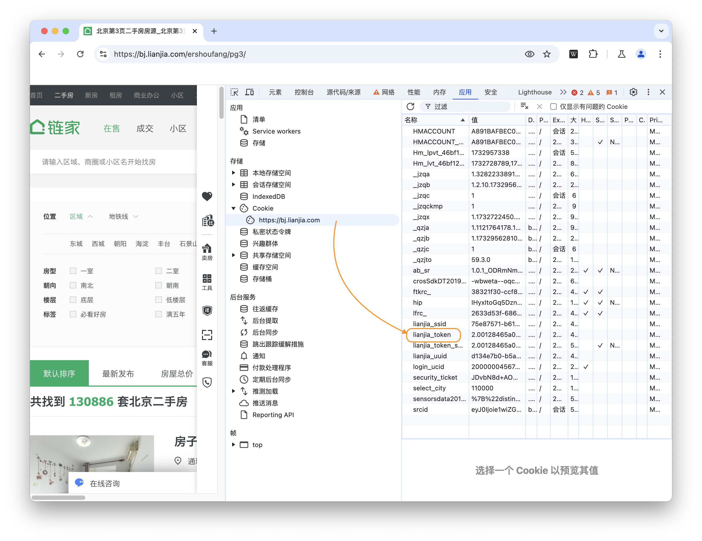

# Lianjia Spider Demo

> 分别爬取链家官网新房和二手房的数据（各爬取从第 3 页开始的 5 页）。根据页面数据，新房要求将楼盘名称、类型、地点、房型、面积、单价和总价的数据保存到 json 文件中；二手房要求将小区名称、地点、房型等信息（字段较多可暂时不拆分）、单价和总价的数据保存到 json 文件中。要求使用 Scrapy 框架，并在一个项目中包含两个爬虫任务。未按要求实现但也爬取到数据的酌情给分。

在数据爬取实验的基础上，还实现了对租房数据的**全部爬取**，说明文档见 [`doc/README.md`](doc)。

## 技术栈

- 爬虫框架：`Scrapy 2.12.0`

- Python 项目管理：`uv`

- 可视化库：`matplotlib 3.9.4`, `seaborn 0.13.2`, `geopandas 1.0.1`

- 数学库：`numpy 2.2.0`, `pandas 2.2.3`

## 快速开始

1. 克隆本项目到本地

    ```git
    git clone https://github.com/Word2VecT/Lianjia-Spider-Demo
    cd Lianjia-Spider-Demo
    ```

2. 安装 `uv` Python 项目管理器（需要 Python 环境以及 `pip`）

    ```bash
    pip install uv
    ```

3. 使用 `uv` 安装虚拟环境

    ```bash
    uv venv
    ```

4. 根据提示,激活虚拟环境 (以 `fish` 为例)

    ```bash
    source .venv/bin/activate.fish
    ```

5. 安装项目依赖

    ```bash
    uv pip install -r pyproject.toml
    ```

6. 启动爬虫

    ```bash
    cd lianjia
    python begin.py
    ```

7. 数据被保存在 `new_house_data.json` 和 `second_hand_house_data.json` 中

8. Enjoy it!

由于按照要求，只爬取了从第 3 页开始的 5 页数据，可以自行修改 [`second_hand_house_spider.py`](lianjia/lianjia/spiders/second_hand_house_spider.py) 和 [`new_house_spider.py`](lianjia/lianjia/spiders/new_house_spider.py) 中的 `start_page` 和 `end_page` 以爬取更多数据。

## 反爬虫机制

链家的反爬虫机制比较简单，在 [`settings.py`](lianjia/lianjia/settings.py) 文件设置 `User-Agent` 以及在 [`second_hand_house_spider.py`](lianjia/lianjia/spiders/second_hand_house_spider.py) 脚本中设置 `cookie` 即可。

设置 `cookie` 还有一个原因是：如果不设置 `cookie`，二手房靠后的页面无法访问，会被重定向至登陆页面。

`cookie` 只需要为自己的 `lianjia_token`。

> `lianjia_token` 是链家用来验证用户身份的核心字段。只要携带了这个字段，服务器就会认为请求是合法的用户发起的，其他 Cookie（如会话信息、埋点数据等）对服务器响应的核心功能不重要。

### 如何获取 `lianjia_token`（Verify on Chrome / Chromium）

开发者工具 $\to$ Applications $\to$ Cookies $\to$ `https://bj.lianjia.com` $\to$ `lianjia_token`


